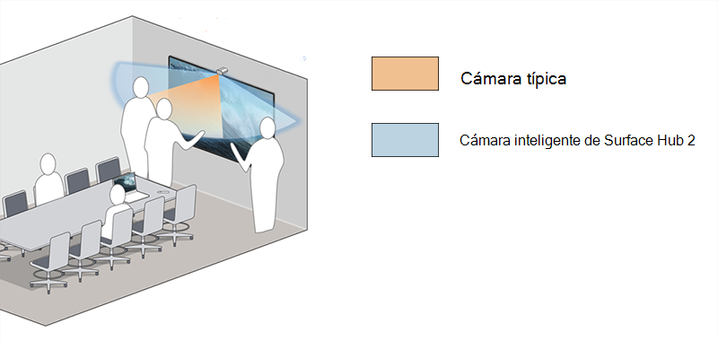

# Instalar y administrar Surface Hub 2 cámaras inteligentes

Surface Hub 2 Smart Camera1 está diseñado para equipos híbridos y optimizado para participantes remotos. Con un enfoque agudo en primer plano y en segundo plano, los participantes remotos pueden ver a las personas interactuar con el contenido de la Surface Hub mientras ven a todos los demás en la sala. Surface Hub 2 Smart Camera tiene un amplio campo de visión de más de 136 grados, enmarcado automático, óptica de vidrio de alta calidad y un sensor de poca luz.

*La vista de cámara ultra ancha incluye pizarras para personas en bordes extremos de 85" Hub*

## Requisitos del sistema

Para Surface Hubs que ejecuta Team OS, Surface Hub 2 Smart Camera requiere las siguientes actualizaciones para la [actualización de Windows 10 Team 2020](surface-hub-2020-update-whats-new.md) (20H2) en Surface Hub 2:

- Windows 10 Team 2020 Update 2 (KB5010415 o una actualización de Windows posterior)
- Actualización de hardware del sistema: 21/1/2022 (o una actualización posterior de hardware del sistema)

Para más información, consulte [Surface Hub historial de actualizaciones](surface-hub-update-history.md).

> [!NOTE]
> No se requieren actualizaciones adicionales para que los Surface Hubs migrados ejecuten Pro o Enterprise Windows 10/11.

## Instalación de una cámara inteligente

1. Conecte la cámara al puerto USB-C en medio de la parte superior de Surface Hub 2. El LED del indicador se iluminará brevemente cuando la cámara esté conectada y continuamente cuando la cámara esté en uso.

     

2. Para quitar la cámara, tire hacia arriba y hacia delante. Una tether magnética impide que la cámara se despega o se despega hacia atrás.

    

> [!TIP]
> La cubierta de la cámara se ajusta magnéticamente a la parte delantera para la privacidad y la parte posterior para el almacenamiento cuando no está en uso.

## Administración de la configuración automática de marcos

El encuadre automático se acerca dinámicamente y te mantiene centrado en el vídeo cuando te mueves. La forma de administrar la configuración depende del sistema operativo instalado en Surface Hub:

- [Windows 10 Team actualización de 2020 (20H2)](#windows-10-team-2020-update-20h2)
- [Windows 11 Desktop en Surface Hub](#windows-11-desktop-on-surface-hub)
- [Windows 10 Desktop en Surface Hub](#windows-10-desktop-on-surface-hub)

### Windows 10 Team actualización de 2020 (20H2)

Al instalar la Surface Hub cámara inteligente, el encuadre automático está habilitado de forma predeterminada. Los administradores pueden administrar la trama automática desde Configuración a través de un botón de alternancia Activado/Desactivado que establece el estado de la trama automática al principio de cada sesión de Surface Hub.

**Para ajustar el encuadre automático:**

1. En el Surface Hub 2S, inicie sesión como **administrador**.

> [!NOTE]
> Si no conoce el nombre de usuario o la contraseña de administrador, tendrá que restablecer el dispositivo. Para obtener más información, consulte [Restablecimiento y recuperación de Surface Hub 2S](/surface-hub/surface-hub-2s-recover-reset).

2. Abra **Configuración** y vaya a **Surface Hub > Llamar a & Audio.**
3. En **Enmarcado automático**, ajuste el botón de alternancia, según corresponda. 
4. Seleccione **Finalizar sesión**; la configuración modificada se aplica al iniciar una nueva sesión. 

Si el botón de alternancia está establecido en **Activado**, la trama automática siempre estará activada de forma predeterminada cuando los usuarios comiencen una sesión en Surface Hub. Si el botón de alternancia está establecido en **Desactivado**, la trama automática siempre estará desactivada de forma predeterminada al iniciar una sesión en Surface Hub.

#### Administración de la configuración de la cámara a través de un proveedor de MDM

Los administradores pueden administrar la trama automática a través del [proveedor de servicios de configuración](/windows/client-management/mdm/surfacehub-csp) (CSP) de Surface Hub desde Intune o un proveedor de administración de dispositivos móviles (MDM) de terceros.

|Configuración de directiva de CSP| Descripción|
|------------------|------------|
|DefaultAutomaticFraming|Si activa esta configuración de directiva, se habilita el encuadre automático. Si desactiva esta configuración de directiva, la trama automática se deshabilita. Si no configura esta configuración de directiva, el enmarcado automático está habilitado. |

Para obtener más información, consulte lo siguiente:

- [Administrar la configuración con un proveedor de MDM](/surface-hub/manage-settings-with-mdm-for-surface-hub#create-custom-configuration-profile)
- [CSP de SurfaceHub: administración de cliente Windows](/windows/client-management/mdm/surfacehub-csp)

### Windows 11 Desktop en Surface Hub

Si ha [migrado la Surface Hub](surface-hub-2s-migrate-os.md) para ejecutar Windows 11 Pro o Windows 11 Empresas, tendrá que activar la trama automática para la cámara inteligente de Surface Hub. De forma predeterminada, la trama automática está desactivada.

Para activar el encuadre automático, vaya a **dispositivos Configuración > Bluetooth & > Administrar cámaras> Surface Hub 2 cámaras inteligentes.**

### Windows 10 Desktop en Surface Hub

La trama automática siempre está habilitada y no se puede deshabilitar ni configurar de otro modo.

## Pedido Surface Hub 2 cámara inteligente

Compra Surface Hub 2 cámaras inteligentes de tu [revendedor autorizado de Microsoft Surface](https://www.microsoft.com/surface/business/where-to-buy-microsoft-surface?).

### Referencias

1. Surface Hub 2 Smart Camera, vendida por separado a partir del 16 de marzo de 2022, ajusta dinámicamente la fuente de vídeo para los participantes remotos. Surface Hub 2 Smart Camera se incluirá en la caja con Surface Hub 2S 85" a partir de mayo de 2022.
