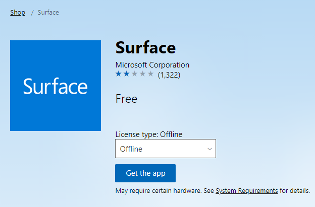

# <span data-ttu-id="98a71-104">Implementar la aplicación Surface con Microsoft Store para empresas y educación</span><span class="sxs-lookup"><span data-stu-id="98a71-104">Deploy Surface app with Microsoft Store for Business and Education</span></span>

**<span data-ttu-id="98a71-105">Se aplica a</span><span class="sxs-lookup"><span data-stu-id="98a71-105">Applies to</span></span>**

- <span data-ttu-id="98a71-106">Portátil Surface Go</span><span class="sxs-lookup"><span data-stu-id="98a71-106">Surface Laptop Go</span></span>
- <span data-ttu-id="98a71-107">Surface Pro 7</span><span class="sxs-lookup"><span data-stu-id="98a71-107">Surface Pro 7</span></span>
- <span data-ttu-id="98a71-108">Portátil Surface 3</span><span class="sxs-lookup"><span data-stu-id="98a71-108">Surface Laptop 3</span></span>
- <span data-ttu-id="98a71-109">Surface Pro 6</span><span class="sxs-lookup"><span data-stu-id="98a71-109">Surface Pro 6</span></span>
- <span data-ttu-id="98a71-110">Surface Laptop 2</span><span class="sxs-lookup"><span data-stu-id="98a71-110">Surface Laptop 2</span></span>
- <span data-ttu-id="98a71-111">Surface Go</span><span class="sxs-lookup"><span data-stu-id="98a71-111">Surface Go</span></span>
- <span data-ttu-id="98a71-112">Ir a la superficie con LTE</span><span class="sxs-lookup"><span data-stu-id="98a71-112">Surface Go with LTE</span></span>
- <span data-ttu-id="98a71-113">Surface Book 2</span><span class="sxs-lookup"><span data-stu-id="98a71-113">Surface Book 2</span></span>
- <span data-ttu-id="98a71-114">Surface Pro con LTE avanzada (modelo 1807)</span><span class="sxs-lookup"><span data-stu-id="98a71-114">Surface Pro with LTE Advanced (Model 1807)</span></span>
- <span data-ttu-id="98a71-115">Surface Pro (modelo 1796)</span><span class="sxs-lookup"><span data-stu-id="98a71-115">Surface Pro (Model 1796)</span></span>
- <span data-ttu-id="98a71-116">Surface Laptop</span><span class="sxs-lookup"><span data-stu-id="98a71-116">Surface Laptop</span></span>
- <span data-ttu-id="98a71-117">Surface Studio</span><span class="sxs-lookup"><span data-stu-id="98a71-117">Surface Studio</span></span>
- <span data-ttu-id="98a71-118">Surface Studio 2</span><span class="sxs-lookup"><span data-stu-id="98a71-118">Surface Studio 2</span></span>
- <span data-ttu-id="98a71-119">Surface Book</span><span class="sxs-lookup"><span data-stu-id="98a71-119">Surface Book</span></span>
- <span data-ttu-id="98a71-120">Surface Pro 4</span><span class="sxs-lookup"><span data-stu-id="98a71-120">Surface Pro 4</span></span>
- <span data-ttu-id="98a71-121">Surface 3 LTE</span><span class="sxs-lookup"><span data-stu-id="98a71-121">Surface 3 LTE</span></span>
- <span data-ttu-id="98a71-122">Surface 3</span><span class="sxs-lookup"><span data-stu-id="98a71-122">Surface 3</span></span>
- <span data-ttu-id="98a71-123">Surface Pro 3</span><span class="sxs-lookup"><span data-stu-id="98a71-123">Surface Pro 3</span></span>


<span data-ttu-id="98a71-124">La aplicación Surface es una aplicación de Microsoft Store ligera que ofrece control de muchas opciones y configuraciones específicas, entre las que se incluyen:</span><span class="sxs-lookup"><span data-stu-id="98a71-124">The Surface app is a lightweight Microsoft Store app that provides control of many Surface-specific settings and options, including:</span></span> 

* <span data-ttu-id="98a71-125">Habilitar o deshabilitar el botón Windows en el dispositivo Surface 
</span><span class="sxs-lookup"><span data-stu-id="98a71-125">Enable or disable the Windows button on the Surface device</span></span> 

* <span data-ttu-id="98a71-126">Ajustar la sensibilidad de un Lápiz para Surface 
</span><span class="sxs-lookup"><span data-stu-id="98a71-126">Adjust the sensitivity of a Surface Pen</span></span> 

* <span data-ttu-id="98a71-127">Personalizar las acciones del botón de Lápiz para Surface 
</span><span class="sxs-lookup"><span data-stu-id="98a71-127">Customize Surface Pen button actions</span></span> 

* <span data-ttu-id="98a71-128">Habilitar o deshabilitar las mejoras de audio de Surface 
</span><span class="sxs-lookup"><span data-stu-id="98a71-128">Enable or disable Surface audio enhancements</span></span> 

* <span data-ttu-id="98a71-129">Acceso rápido a la documentación de soporte técnico y a la información del dispositivo</span><span class="sxs-lookup"><span data-stu-id="98a71-129">Quick access to support documentation and information for your device</span></span>

<span data-ttu-id="98a71-130">Los clientes que usen Windows Update recibirán la aplicación Surface normalmente como parte de las actualizaciones automáticas.</span><span class="sxs-lookup"><span data-stu-id="98a71-130">Customers using Windows Update will ordinarily receive Surface app as part of automatic updates.</span></span> <span data-ttu-id="98a71-131">Pero si su organización está preparando imágenes para su implementación en sus dispositivos Surface, es posible que desee incluir la aplicación Surface (anteriormente denominada Surface hub) en el proceso de creación de imágenes y de implementación en lugar de requerir que los usuarios de cada dispositivo descarguen e instalen la aplicación de Microsoft Store o de Microsoft Store para empresas.</span><span class="sxs-lookup"><span data-stu-id="98a71-131">But if your organization is preparing images for deployment to your Surface devices, you may want to include the Surface app (formerly called the Surface Hub) in your imaging and deployment process instead of requiring users of each individual device to download and install the app from the Microsoft Store or your Microsoft Store for Business.</span></span> 

> [!NOTE]
> <span data-ttu-id="98a71-132">Este artículo no se aplica a Surface Pro X. Para obtener más información, consulte [implementación, administración y mantenimiento de Surface Pro X](surface-pro-arm-app-management.md)</span><span class="sxs-lookup"><span data-stu-id="98a71-132">This article does not apply to Surface Pro X. For more information, refer to [Deploying, managing, and servicing Surface Pro X](surface-pro-arm-app-management.md)</span></span>

## <span data-ttu-id="98a71-133">Información general de Surface App</span><span class="sxs-lookup"><span data-stu-id="98a71-133">Surface app overview</span></span>

<span data-ttu-id="98a71-134">La aplicación Surface está disponible como una descarga gratuita de [Microsoft Store](https://www.microsoft.com/store/apps/Surface/9WZDNCRFJB8P).</span><span class="sxs-lookup"><span data-stu-id="98a71-134">The Surface app is available as a free download from the [Microsoft Store](https://www.microsoft.com/store/apps/Surface/9WZDNCRFJB8P).</span></span> <span data-ttu-id="98a71-135">Los usuarios pueden descargarlo e instalarlo desde Microsoft Store, pero si su organización usa Microsoft Store for Business en su lugar, tendrá que agregarlo al inventario de su tienda y posiblemente incluir la aplicación como parte del proceso de implementación de Windows.</span><span class="sxs-lookup"><span data-stu-id="98a71-135">Users can download and install it from the Microsoft Store, but if your organization uses Microsoft Store for Business instead, you will need to add it to your store’s inventory and possibly include the app as part of your Windows deployment process.</span></span> <span data-ttu-id="98a71-136">Estos procesos se tratan en este artículo.</span><span class="sxs-lookup"><span data-stu-id="98a71-136">These processes are discussed throughout this article.</span></span> <span data-ttu-id="98a71-137">Para obtener más información acerca de Microsoft Store para empresas, consulte [Microsoft Store para empresas](https://docs.microsoft.com/microsoft-store/) en Windows TechCenter.</span><span class="sxs-lookup"><span data-stu-id="98a71-137">For more information about Microsoft Store for Business, see [Microsoft Store for Business](https://docs.microsoft.com/microsoft-store/) in the Windows TechCenter.</span></span> 

## <span data-ttu-id="98a71-138">Agregar una aplicación de Surface a una cuenta de Microsoft Store para empresas</span><span class="sxs-lookup"><span data-stu-id="98a71-138">Add Surface app to a Microsoft Store for Business account</span></span> 

<span data-ttu-id="98a71-139">Antes de que los usuarios puedan instalar o implementar una aplicación de una cuenta de Microsoft Store para empresas, primero debe estar disponible y conceder la licencia a los usuarios de una empresa.</span><span class="sxs-lookup"><span data-stu-id="98a71-139">Before users can install or deploy an app from a company’s Microsoft Store for Business account, the desired app(s) must first be made available and licensed to the users of a business.</span></span> 

1. <span data-ttu-id="98a71-140">Si aún no lo ha hecho, cree una [cuenta de Microsoft Store para empresas](https://www.microsoft.com/business-store).</span><span class="sxs-lookup"><span data-stu-id="98a71-140">If you have not already done so, create a [Microsoft Store for Business account](https://www.microsoft.com/business-store).</span></span> 

2. <span data-ttu-id="98a71-141">Inicie sesión en el portal.</span><span class="sxs-lookup"><span data-stu-id="98a71-141">Log on to the portal.</span></span> 

3. <span data-ttu-id="98a71-142">Habilitar licencias sin conexión: haga clic en **administrar->configuración**de la tienda y, a continuación, seleccione la casilla **Mostrar aplicaciones con licencias sin conexión a personas que se van a comprar en la tienda** , como se muestra en la ilustración 1.</span><span class="sxs-lookup"><span data-stu-id="98a71-142">Enable offline licensing: click **Manage->Store settings**, and then select the **Show offline licensed apps to people shopping in the store** checkbox, as shown in Figure 1.</span></span> <span data-ttu-id="98a71-143">Para obtener más información sobre los modelos de licencias de aplicaciones de Microsoft Store para empresas, consulte [aplicaciones en Microsoft Store para empresas y educación](https://docs.microsoft.com/microsoft-store/).</span><span class="sxs-lookup"><span data-stu-id="98a71-143">For more information about Microsoft Store for Business app licensing models, see [Apps in Microsoft Store for Business and Education](https://docs.microsoft.com/microsoft-store/).</span></span>

   > [!div class="mx-imgBorder"]
   > <br/>
   *<span data-ttu-id="98a71-145">Figura 1.</span><span class="sxs-lookup"><span data-stu-id="98a71-145">Figure 1.</span></span> <span data-ttu-id="98a71-146">Habilitar aplicaciones para su uso sin conexión</span><span class="sxs-lookup"><span data-stu-id="98a71-146">Enable apps for offline use</span></span>*

4. <span data-ttu-id="98a71-147">Agregue la aplicación Surface a su cuenta de Microsoft Store para empresas siguiendo este procedimiento:</span><span class="sxs-lookup"><span data-stu-id="98a71-147">Add Surface app to your Microsoft Store for Business account by following this procedure:</span></span>

    * <span data-ttu-id="98a71-148">Haga clic en el menú de **tienda** .</span><span class="sxs-lookup"><span data-stu-id="98a71-148">Click the **Shop** menu.</span></span>
    
    * <span data-ttu-id="98a71-149">En el cuadro de búsqueda, escriba **Surface App**y, a continuación, haga clic en el icono de búsqueda.</span><span class="sxs-lookup"><span data-stu-id="98a71-149">In the search box, type **Surface app**, and then click the search icon.</span></span>
    
    * <span data-ttu-id="98a71-150">Una vez que se presente la aplicación Surface en los resultados de la búsqueda, haga clic en el icono de la aplicación.</span><span class="sxs-lookup"><span data-stu-id="98a71-150">After the Surface app is presented in the search results, click the app’s icon.</span></span>
    
    * <span data-ttu-id="98a71-151">Se le presenta una opción (seleccione **en línea** o **sin conexión**), como se muestra en la figura 2.</span><span class="sxs-lookup"><span data-stu-id="98a71-151">You are presented with a choice (select **Online** or **Offline**), as shown in Figure 2.</span></span>
    
      > [!div class="mx-imgBorder"]
      >    
      *<span data-ttu-id="98a71-153">Figura 2.</span><span class="sxs-lookup"><span data-stu-id="98a71-153">Figure 2.</span></span> <span data-ttu-id="98a71-154">Seleccione el modo de licencia sin conexión y agregue la aplicación al inventario.</span><span class="sxs-lookup"><span data-stu-id="98a71-154">Select the Offline licensing mode and add the app to your inventory</span></span>*
    
    * <span data-ttu-id="98a71-155">Haga clic en **sin conexión** para seleccionar el modo de licencias sin conexión.</span><span class="sxs-lookup"><span data-stu-id="98a71-155">Click **Offline** to select the Offline licensing mode.</span></span>
    
    * <span data-ttu-id="98a71-156">Haga clic en **obtener la aplicación** para agregar la aplicación a su inventario de Microsoft Store para empresas.</span><span class="sxs-lookup"><span data-stu-id="98a71-156">Click **Get the app** to add the app to your Microsoft Store for Business inventory.</span></span> <span data-ttu-id="98a71-157">Como se muestra en la figura 3, verá un cuadro de diálogo que le pide que confirme que las aplicaciones sin conexión se pueden implementar con una herramienta de administración o se descargan desde la página de inventario de la empresa en su tienda privada.</span><span class="sxs-lookup"><span data-stu-id="98a71-157">As shown in Figure 3, you’ll see a dialog box that prompts you to acknowledge that offline apps can be deployed using a management tool or downloaded from the company’s inventory page in their private store.</span></span>
    
      > [!div class="mx-imgBorder"]
      > 
       *ilustración 3. Confirmación de aplicación con licencia sin conexión*</span><span class="sxs-lookup"><span data-stu-id="98a71-158">Offline-licensed app acknowledgement window](images/deploysurfapp-fig3-acknowledge.png "Offline-licensed app acknowledgement window")
*Figure 3. Offline-licensed app acknowledgement*</span></span>
      
    * <span data-ttu-id="98a71-159">Haga clic en **Aceptar**.</span><span class="sxs-lookup"><span data-stu-id="98a71-159">Click **OK**.</span></span>

## <span data-ttu-id="98a71-160">Descargar Surface App desde una cuenta de Microsoft Store para empresas</span><span class="sxs-lookup"><span data-stu-id="98a71-160">Download Surface app from a Microsoft Store for Business account</span></span>
<span data-ttu-id="98a71-161">Después de agregar una aplicación a la cuenta de Microsoft Store para empresas en el modo sin conexión, puede descargar y agregar la aplicación como un AppxBundle a un recurso compartido de implementación.</span><span class="sxs-lookup"><span data-stu-id="98a71-161">After you add an app to the Microsoft Store for Business account in Offline mode, you can download and add the app as an AppxBundle to a deployment share.</span></span>

1. <span data-ttu-id="98a71-162">Inicie sesión en la cuenta de Microsoft Store para empresas en https://businessstore.microsoft.com .</span><span class="sxs-lookup"><span data-stu-id="98a71-162">Log on to the Microsoft Store for Business account at https://businessstore.microsoft.com.</span></span>

2. <span data-ttu-id="98a71-163">Haga clic en **administrar->aplicaciones & software**.</span><span class="sxs-lookup"><span data-stu-id="98a71-163">Click **Manage->Apps & software**.</span></span> <span data-ttu-id="98a71-164">Se muestra una lista de todas las aplicaciones de su empresa, incluida la aplicación Surface que agregó en la [aplicación agregar Surface a una cuenta de Microsoft Store para empresas](#add-surface-app-to-a-microsoft-store-for-business-account) en este artículo.</span><span class="sxs-lookup"><span data-stu-id="98a71-164">A list of all of your company’s apps is displayed, including the Surface app you added in the [Add Surface app to a Microsoft Store for Business account](#add-surface-app-to-a-microsoft-store-for-business-account) section of this article.</span></span>

3. <span data-ttu-id="98a71-165">En **acciones**, haga clic en los puntos suspensivos (**...**) y, a continuación, haga clic en **descargar para usar sin conexión** en la aplicación Surface.</span><span class="sxs-lookup"><span data-stu-id="98a71-165">Under **Actions**, click the ellipsis (**…**), and then click **Download for offline use** for the Surface app.</span></span>

4. <span data-ttu-id="98a71-166">Seleccione las opciones de **plataforma** y **arquitectura** que desee de las selecciones disponibles para la aplicación seleccionada, como se muestra en la ilustración 4.</span><span class="sxs-lookup"><span data-stu-id="98a71-166">Select the desired **Platform** and **Architecture** options from the available selections for the selected app, as shown in Figure 4.</span></span>

    > [!div class="mx-imgBorder"]
    > <br/>
    *<span data-ttu-id="98a71-168">Figura 4.</span><span class="sxs-lookup"><span data-stu-id="98a71-168">Figure 4.</span></span> <span data-ttu-id="98a71-169">Descargar el paquete AppxBundle de una aplicación</span><span class="sxs-lookup"><span data-stu-id="98a71-169">Download the AppxBundle package for an app</span></span>*
    
5. <span data-ttu-id="98a71-170">Haga clic en **Descargar**.</span><span class="sxs-lookup"><span data-stu-id="98a71-170">Click **Download**.</span></span> <span data-ttu-id="98a71-171">El paquete AppxBundle se descargará.</span><span class="sxs-lookup"><span data-stu-id="98a71-171">The AppxBundle package will be downloaded.</span></span> <span data-ttu-id="98a71-172">Asegúrese de que anota la ruta de acceso del archivo descargado porque lo necesitará más adelante en este artículo.</span><span class="sxs-lookup"><span data-stu-id="98a71-172">Make sure you note the path of the downloaded file because you’ll need that later in this article.</span></span>

6. <span data-ttu-id="98a71-173">Haga clic en la opción **licencia codificada** o en **licencia sin codificar** .</span><span class="sxs-lookup"><span data-stu-id="98a71-173">Click either the **Encoded license** or **Unencoded license** option.</span></span> <span data-ttu-id="98a71-174">Use la opción de licencia codificada con herramientas de administración como Microsoft Endpoint Configuration Manager o cuando use el diseñador de configuración de Windows para crear un paquete de aprovisionamiento.</span><span class="sxs-lookup"><span data-stu-id="98a71-174">Use the Encoded license option with management tools like Microsoft Endpoint Configuration Manager or when you use Windows Configuration Designer to create a provisioning package.</span></span> <span data-ttu-id="98a71-175">Seleccione la opción de licencia sin codificar al usar administración y mantenimiento de imágenes de implementación (DISM) o soluciones de implementación basadas en Imaging, incluido Microsoft Deployment Toolkit (MDT).</span><span class="sxs-lookup"><span data-stu-id="98a71-175">Select the Unencoded license option when you use Deployment Image Servicing and Management (DISM) or deployment solutions based on imaging, including the Microsoft Deployment Toolkit (MDT).</span></span>

7. <span data-ttu-id="98a71-176">Haga clic en **generar** para generar y descargar la licencia de la aplicación.</span><span class="sxs-lookup"><span data-stu-id="98a71-176">Click **Generate** to generate and download the license for the app.</span></span> <span data-ttu-id="98a71-177">Asegúrese de que anota la ruta de acceso del archivo de licencia porque lo necesitará más adelante en este artículo.</span><span class="sxs-lookup"><span data-stu-id="98a71-177">Make sure you note the path of the license file because you’ll need that later in this article.</span></span>

>[!NOTE]
><span data-ttu-id="98a71-178">Al descargar una aplicación para su uso sin conexión, como la aplicación Surface, es posible que observe una sección en la parte inferior de la página denominada **frameworks requerido**.</span><span class="sxs-lookup"><span data-stu-id="98a71-178">When you download an app for offline use, such as the Surface app, you may notice a section at the bottom of the page labeled **Required frameworks**.</span></span> <span data-ttu-id="98a71-179">Los equipos de destino deben tener instalados los marcos de trabajo de la aplicación, por lo que es posible que tenga que repetir el proceso de descarga para cada uno de los marcos de trabajo necesarios para su arquitectura (x86 o x64) e incluirlos como parte de la implementación de Windows que se trata más adelante en este artículo.</span><span class="sxs-lookup"><span data-stu-id="98a71-179">Your target computers must have the frameworks installed for the app to run, so you may need to repeat the download process for each of the required frameworks for your architecture (either x86 or x64) and also include them as part of your Windows deployment discussed later in this article.</span></span>

<span data-ttu-id="98a71-180">La figura 5 muestra los marcos de trabajo necesarios para Surface app.</span><span class="sxs-lookup"><span data-stu-id="98a71-180">Figure 5 shows the required frameworks for the Surface app.</span></span>

> [!div class="mx-imgBorder"]
> <br/>
*<span data-ttu-id="98a71-182">Figura 5.</span><span class="sxs-lookup"><span data-stu-id="98a71-182">Figure 5.</span></span> <span data-ttu-id="98a71-183">Marcos necesarios para la aplicación Surface</span><span class="sxs-lookup"><span data-stu-id="98a71-183">Required frameworks for the Surface app</span></span>*

>[!NOTE]
><span data-ttu-id="98a71-184">Los números de versión de la aplicación Surface y los marcos obligatorios cambiarán a medida que se actualicen las aplicaciones.</span><span class="sxs-lookup"><span data-stu-id="98a71-184">The version numbers of the Surface app and required frameworks will change as the apps are updated.</span></span> <span data-ttu-id="98a71-185">Busque la última versión de Surface App y de cada marco en Microsoft Store para empresas.</span><span class="sxs-lookup"><span data-stu-id="98a71-185">Check for the latest version of Surface app and each framework in Microsoft Store for Business.</span></span> <span data-ttu-id="98a71-186">Use siempre la aplicación de Surface y las versiones de marco recomendadas proporcionadas por Microsoft Store para empresas.</span><span class="sxs-lookup"><span data-stu-id="98a71-186">Always use the Surface app and recommended framework versions as provided by Microsoft Store for Business.</span></span> <span data-ttu-id="98a71-187">El uso de Marcos anticuados o de versiones incorrectas puede producir errores o bloqueos de la aplicación.</span><span class="sxs-lookup"><span data-stu-id="98a71-187">Using outdated frameworks or the incorrect versions may result in errors or application crashes.</span></span>

<span data-ttu-id="98a71-188">Para descargar los marcos necesarios para la aplicación Surface, siga estos pasos:</span><span class="sxs-lookup"><span data-stu-id="98a71-188">To download the required frameworks for the Surface app, follow these steps:</span></span>

1. <span data-ttu-id="98a71-189">Haga clic en el botón **Descargar** en **Microsoft. VCLibs. 140.00 _14.0.23816.0 _x64__8wekyb3d8bbwe**.</span><span class="sxs-lookup"><span data-stu-id="98a71-189">Click the **Download** button under **Microsoft.VCLibs.140.00_14.0.23816.0_x64__8wekyb3d8bbwe**.</span></span> <span data-ttu-id="98a71-190">Esto descarga el Microsoft. VCLibs. 140.00 _14.0.23816.0 _x64__8wekyb3d8bbwe. Appx a la carpeta especificada.</span><span class="sxs-lookup"><span data-stu-id="98a71-190">This downloads the Microsoft.VCLibs.140.00_14.0.23816.0_x64__8wekyb3d8bbwe.Appx file to your specified folder.</span></span>

2. <span data-ttu-id="98a71-191">Haga clic en el botón **Descargar** en **Microsoft. net. Native. Runtime. 1.1 _ 1.23406 _x64__8wekyb3d8bbwe**.</span><span class="sxs-lookup"><span data-stu-id="98a71-191">Click the **Download** button under **Microsoft.NET.Native.Runtime.1.1_1.1.23406.0_x64__8wekyb3d8bbwe**.</span></span> <span data-ttu-id="98a71-192">Esto descarga el archivo Microsoft. NET. Native. Runtime. 1.1 _ 1.1.23406.0 _x64__8wekyb3d8bbwe. appx en la carpeta especificada.</span><span class="sxs-lookup"><span data-stu-id="98a71-192">This downloads the Microsoft.NET.Native.Runtime.1.1_1.1.23406.0_x64__8wekyb3d8bbwe.Appx file to your specified folder.</span></span>

>[!NOTE]
><span data-ttu-id="98a71-193">Para los dispositivos Surface, solo se necesita la versión de 64 bits (x64) de cada marco.</span><span class="sxs-lookup"><span data-stu-id="98a71-193">Only the 64-bit (x64) version of each framework is required for Surface devices.</span></span> <span data-ttu-id="98a71-194">Los dispositivos Surface son dispositivos UEFI nativos de 64 bits y no son compatibles con las versiones de Windows de 32 bits (x86) que requerirían marcos de trabajo de 32.</span><span class="sxs-lookup"><span data-stu-id="98a71-194">Surface devices are native 64-bit UEFI devices and are not compatible with 32-bit (x86) versions of Windows that would require 32-bit frameworks.</span></span> 

## <span data-ttu-id="98a71-195">Instalar la aplicación Surface en el equipo con PowerShell</span><span class="sxs-lookup"><span data-stu-id="98a71-195">Install Surface app on your computer with PowerShell</span></span>
<span data-ttu-id="98a71-196">El procedimiento siguiente indica la aplicación Surface en el equipo y la pone a disposición de todas las cuentas de usuario creadas en el equipo después.</span><span class="sxs-lookup"><span data-stu-id="98a71-196">The following procedure provisions the Surface app onto your computer and makes it available for any user accounts created on the computer afterwards.</span></span>

1. <span data-ttu-id="98a71-197">Con el procedimiento descrito en la sección [Cómo descargar la aplicación de Surface desde una cuenta de Microsoft Store para empresas](#download-surface-app-from-a-microsoft-store-for-business-account) de este artículo, descarga el archivo AppxBundle de la aplicación de Surface y el archivo de licencia.</span><span class="sxs-lookup"><span data-stu-id="98a71-197">Using the procedure described in the [How to download Surface app from a Microsoft Store for Business account](#download-surface-app-from-a-microsoft-store-for-business-account) section of this article, download the Surface app AppxBundle and license file.</span></span> 

2. <span data-ttu-id="98a71-198">Comienza una sesión de PowerShell con privilegios elevados.</span><span class="sxs-lookup"><span data-stu-id="98a71-198">Begin an elevated PowerShell session.</span></span>

    >[!NOTE]
    ><span data-ttu-id="98a71-199">Si no ejecuta PowerShell como administrador, la sesión no tendrá los permisos necesarios para instalar la aplicación.</span><span class="sxs-lookup"><span data-stu-id="98a71-199">If you don’t run PowerShell as an Administrator, the session won’t have the required permissions to install the app.</span></span>
    
3. <span data-ttu-id="98a71-200">En la sesión de PowerShell con privilegios elevados, copia y pega el siguiente comando: </span><span class="sxs-lookup"><span data-stu-id="98a71-200">In the elevated PowerShell session, copy and paste the following command:</span></span>

    ```powershell
    Add-AppxProvisionedPackage –Online –PackagePath <DownloadPath>\ Microsoft.SurfaceHub_10.0.342.0_neutral_~_8wekyb3d8bbwe.AppxBundle –LicensePath <DownloadPath>\ Microsoft.SurfaceHub_8wekyb3d8bbwe_a53ef8ab-9dbd-dec1-46c5-7b664d4dd003.xml
    ```

    <span data-ttu-id="98a71-201">Donde `<DownloadPath>` es la carpeta donde descargó el archivo AppxBundle y el archivo de licencia de la cuenta de Microsoft Store para empresas.</span><span class="sxs-lookup"><span data-stu-id="98a71-201">Where `<DownloadPath>` is the folder where you downloaded the AppxBundle and license file from the Microsoft Store for Business account.</span></span>

    <span data-ttu-id="98a71-202">Por ejemplo, si ha descargado los archivos en c:\Temp, el comando que ejecuta es el siguiente:</span><span class="sxs-lookup"><span data-stu-id="98a71-202">For example, if you downloaded the files to c:\Temp, the command you run is:</span></span>
    
    ```powershell
    Add-AppxProvisionedPackage –Online –PackagePath c:\Temp\ Microsoft.SurfaceHub_10.0.342.0_neutral_~_8wekyb3d8bbwe.AppxBundle –LicensePath c:\Temp\ Microsoft.SurfaceHub_8wekyb3d8bbwe_a53ef8ab-9dbd-dec1-46c5-7b664d4dd003.xml
    ```

4. <span data-ttu-id="98a71-203">La aplicación Surface ahora estará disponible en tu equipo Windows actual.</span><span class="sxs-lookup"><span data-stu-id="98a71-203">The Surface app will now be available on your current Windows computer.</span></span> 

   <span data-ttu-id="98a71-204">Antes de que la aplicación Surface sea funcional en el equipo donde se ha aprovisionado, también debe aprovisionar los marcos descritos anteriormente en este artículo.</span><span class="sxs-lookup"><span data-stu-id="98a71-204">Before the Surface app is functional on the computer where it has been provisioned, you must also provision the frameworks described earlier in this article.</span></span> <span data-ttu-id="98a71-205">Para aprovisionar estos marcos, use el procedimiento siguiente en la sesión de PowerShell con privilegios elevados que usó para aprovisionar la aplicación Surface.</span><span class="sxs-lookup"><span data-stu-id="98a71-205">To provision these frameworks, use the following procedure in the elevated PowerShell session you used to provision the Surface app.</span></span>

5. <span data-ttu-id="98a71-206">En la sesión de PowerShell con privilegios elevados, copia y pega el siguiente comando: </span><span class="sxs-lookup"><span data-stu-id="98a71-206">In the elevated PowerShell session, copy and paste the following command:</span></span>

   ```powershell
   Add-AppxProvisionedPackage –Online –SkipLicense –PackagePath <DownloadPath>\Microsoft.VCLibs.140.00_14.0.23816.0_x64__8wekyb3d8bbwe.Appx
   ```
   
6. <span data-ttu-id="98a71-207">En la sesión de PowerShell con privilegios elevados, copia y pega el siguiente comando: </span><span class="sxs-lookup"><span data-stu-id="98a71-207">In the elevated PowerShell session, copy and paste the following command:</span></span>

   ```powershell
   Add-AppxProvisionedPackage –Online –SkipLicense –PackagePath <DownloadPath>\Microsoft.NET.Native.Runtime.1.1_1.1.23406.0_x64__8wekyb3d8bbwe.Appx
   ```

## <span data-ttu-id="98a71-208">Instalar la aplicación Surface con MDT</span><span class="sxs-lookup"><span data-stu-id="98a71-208">Install Surface app with MDT</span></span>
<span data-ttu-id="98a71-209">El siguiente procedimiento usa MDT para automatizar la instalación de Surface app en el momento de la implementación.</span><span class="sxs-lookup"><span data-stu-id="98a71-209">The following procedure uses MDT to automate installation of the Surface app at the time of deployment.</span></span> <span data-ttu-id="98a71-210">MDT aprovisiona la aplicación automáticamente durante la implementación y, por lo tanto, puedes usar este proceso con las imágenes existentes.</span><span class="sxs-lookup"><span data-stu-id="98a71-210">The application is provisioned automatically by MDT during deployment and thus you can use this process with existing images.</span></span> <span data-ttu-id="98a71-211">Este es el proceso recomendado para implementar la aplicación Surface como parte de una implementación de Windows para Surface Devices porque no reduce la compatibilidad entre plataformas de la imagen de Windows.</span><span class="sxs-lookup"><span data-stu-id="98a71-211">This is the recommended process to deploy the Surface app as part of a Windows deployment to Surface devices because it does not reduce the cross platform compatibility of the Windows image.</span></span>

1. <span data-ttu-id="98a71-212">Con el procedimiento descrito [anteriormente en este artículo](#download-surface-app-from-a-microsoft-store-for-business-account), descargue el archivo AppxBundle de la aplicación superficial y el archivo de licencia.</span><span class="sxs-lookup"><span data-stu-id="98a71-212">Using the procedure described [earlier in this article](#download-surface-app-from-a-microsoft-store-for-business-account), download the Surface app AppxBundle and license file.</span></span> 

2. <span data-ttu-id="98a71-213">Con el Asistente para nueva aplicación de MDT Deployment Workbench, importe los archivos descargados como una nueva **aplicación con archivos de origen**.</span><span class="sxs-lookup"><span data-stu-id="98a71-213">Using the New Application Wizard in the MDT Deployment Workbench, import the downloaded files as a new **Application with source files**.</span></span>

3. <span data-ttu-id="98a71-214">En la página **detalles del comando** del Asistente para crear nueva aplicación, especifique el directorio de **trabajo** predeterminado y, para el **comando** , especifique el nombre de archivo AppxBundle de la siguiente manera:</span><span class="sxs-lookup"><span data-stu-id="98a71-214">On the **Command Details** page of the New Application Wizard, specify the default **Working Directory** and for the **Command** specify the file name of the AppxBundle, as follows:</span></span>

   * <span data-ttu-id="98a71-215">Mando</span><span class="sxs-lookup"><span data-stu-id="98a71-215">Command:</span></span>
   
     ```console
     Microsoft.SurfaceHub_10.0.342.0_neutral_~_8wekyb3d8bbwe.AppxBundle
     ```
     
   * <span data-ttu-id="98a71-216">Directorio de trabajo:%DEPLOYROOT%\Applications\SurfaceApp</span><span class="sxs-lookup"><span data-stu-id="98a71-216">Working Directory: %DEPLOYROOT%\Applications\SurfaceApp</span></span>

<span data-ttu-id="98a71-217">Para que la aplicación Surface funcione en el equipo de destino, también necesitará los marcos descritos anteriormente en este artículo.</span><span class="sxs-lookup"><span data-stu-id="98a71-217">For the Surface app to function on the target computer, it will also require the frameworks described earlier in this article.</span></span> <span data-ttu-id="98a71-218">Use el siguiente procedimiento para importar los marcos necesarios para la aplicación de Surface en MDT y para configurarlos como dependencias.</span><span class="sxs-lookup"><span data-stu-id="98a71-218">Use the following procedure to import the frameworks required for the Surface app into MDT and to configure them as dependencies.</span></span>

1. <span data-ttu-id="98a71-219">Con el procedimiento descrito anteriormente en este artículo, descargue los archivos de Framework.</span><span class="sxs-lookup"><span data-stu-id="98a71-219">Using the procedure described earlier in this article, download the framework files.</span></span> <span data-ttu-id="98a71-220">Almacene cada marco en una carpeta diferente.</span><span class="sxs-lookup"><span data-stu-id="98a71-220">Store each framework in a separate folder.</span></span>

2. <span data-ttu-id="98a71-221">Con el Asistente para nueva aplicación de MDT Deployment Workbench, importe los archivos descargados como una nueva **aplicación con archivos de origen**.</span><span class="sxs-lookup"><span data-stu-id="98a71-221">Using the New Application Wizard in the MDT Deployment Workbench, import the downloaded files as a new **Application with source files**.</span></span>

3. <span data-ttu-id="98a71-222">En la página **detalles del comando** , escriba el nombre de archivo de cada aplicación que haya descargado en el campo **comando** y el directorio de trabajo predeterminado.</span><span class="sxs-lookup"><span data-stu-id="98a71-222">On the **Command Details** page, type the file name of each application you downloaded in the **Command** field and the default Working Directory.</span></span>

<span data-ttu-id="98a71-223">Para configurar los marcos como dependencias de la aplicación Surface, use este proceso:</span><span class="sxs-lookup"><span data-stu-id="98a71-223">To configure the frameworks as dependencies of the Surface app, use this process:</span></span>

1. <span data-ttu-id="98a71-224">Abra las propiedades de la aplicación de Surface en el MDT Deployment Workbench.</span><span class="sxs-lookup"><span data-stu-id="98a71-224">Open the properties of the Surface app in the MDT Deployment Workbench.</span></span>

2. <span data-ttu-id="98a71-225">Haga clic en la pestaña **dependencias** y, a continuación, en **Agregar**.</span><span class="sxs-lookup"><span data-stu-id="98a71-225">Click the **Dependencies** tab, and then click **Add**.</span></span>

3. <span data-ttu-id="98a71-226">Active la casilla de verificación de cada marco de trabajo con el nombre que proporcionó en el Asistente para nueva aplicación.</span><span class="sxs-lookup"><span data-stu-id="98a71-226">Select the check box for each framework using the name you provided in the New Application Wizard.</span></span>

<span data-ttu-id="98a71-227">Después de la importación, la aplicación Surface estará disponible para su selección en el paso **aplicaciones** del Asistente para la implementación de Windows.</span><span class="sxs-lookup"><span data-stu-id="98a71-227">After import, the Surface app will be available for selection in the **Applications** step of the Windows Deployment Wizard.</span></span> <span data-ttu-id="98a71-228">Para instalar la aplicación automáticamente, también puedes especificar la aplicación en la secuencia de tareas de implementación siguiendo este proceso:</span><span class="sxs-lookup"><span data-stu-id="98a71-228">You can also install the application automatically by specifying the application in the deployment task sequence by following this process:</span></span>

1. <span data-ttu-id="98a71-229">Abre la secuencia de tareas de implementación en Deployment Workbench de MDT.</span><span class="sxs-lookup"><span data-stu-id="98a71-229">Open your deployment task sequence in the MDT Deployment Workbench.</span></span>

2. <span data-ttu-id="98a71-230">Agrega una nueva tarea **Instalar aplicación** en la sección **Restaurar estado** de la implementación.</span><span class="sxs-lookup"><span data-stu-id="98a71-230">Add a new **Install Application** task in the **State Restore** section of deployment.</span></span>

3. <span data-ttu-id="98a71-231">Seleccione **instalar una sola aplicación** y especifique la aplicación **Surface** como la **aplicación que se instalará**.</span><span class="sxs-lookup"><span data-stu-id="98a71-231">Select **Install a single application** and specify the **Surface App** as the **Application to be installed**.</span></span>

<span data-ttu-id="98a71-232">Para obtener más información sobre cómo incluir aplicaciones en sus implementaciones de Windows, consulte [implementar Windows 10 con Microsoft Deployment Toolkit](https://technet.microsoft.com/itpro/windows/deploy/deploy-windows-10-with-the-microsoft-deployment-toolkit).</span><span class="sxs-lookup"><span data-stu-id="98a71-232">For more information about including apps into your Windows deployments, see [Deploy Windows 10 with the Microsoft Deployment Toolkit](https://technet.microsoft.com/itpro/windows/deploy/deploy-windows-10-with-the-microsoft-deployment-toolkit).</span></span>
