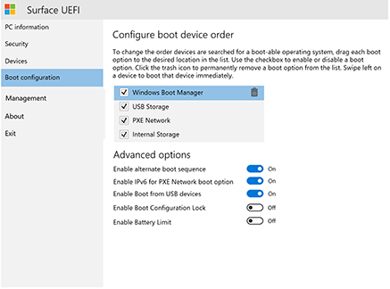

# Administrar la configuración de la UEFI de SurfaceManage Surface UEFI settings

Todas las generaciones actuales y futuras de dispositivos de superficie usan una interfaz de firmware extensible (UEFI) única diseñada por Microsoft específicamente para estos dispositivos.All current and future generations of Surface devices use a unique Unified Extensible Firmware Interface (UEFI) engineered by Microsoft specifically for these devices. La configuración de Surface UEFI ofrece la capacidad de habilitar o deshabilitar dispositivos y componentes integrados, proteger la configuración de UEFI y ajustar la configuración de inicio del dispositivo Surface.Surface UEFI settings provide the ability to enable or disable built-in devices and components, protect UEFI settings from being changed, and adjust the Surface device boot settings. 

## Productos admitidosSupported products

La administración de UEFI es compatible con los siguientes elementos:UEFI management is supported on the following: 

- Surface Pro 4, Surface Pro (5º gen), Surface Pro 6, Surface Pro 7, Surface Pro XSurface Pro 4, Surface Pro (5th Gen), Surface Pro 6, Surface Pro 7, Surface Pro X
- Portátil Surface (1. ª gen), portátil Surface 2, portátil Surface 3, Surface portátil GoSurface Laptop (1st Gen), Surface Laptop 2, Surface Laptop 3, Surface Laptop Go
- Surface Studio (primer gen), Surface Studio 2Surface Studio (1st Gen), Surface Studio 2
- Libro de superficie, libro de superficie 2, Surface Book 3Surface Book, Surface Book 2, Surface Book 3
- Surface Go, Surface Go 2Surface Go, Surface Go 2

## Compatibilidad con la administración basada en la nubeSupport for cloud-based management

Con los perfiles de la interfaz de configuración de firmware (DFCI) integrado en Microsoft Intune (ahora disponible en la versión preliminar pública), la administración de Surface UEFI amplía la pila de administración moderna al nivel de hardware de UEFI.With Device Firmware Configuration Interface (DFCI) profiles built into Microsoft Intune (now available in public preview), Surface UEFI management extends the modern management stack down to the UEFI hardware level. DFCI es compatible con el aprovisionamiento sin contacto, elimina las contraseñas del BIOS, proporciona el control de la configuración de seguridad, incluidas las opciones de arranque y los periféricos integrados, y establece las bases para escenarios de seguridad avanzada en el futuro.DFCI supports zero-touch provisioning, eliminates BIOS passwords, provides control of security settings including boot options and built-in peripherals, and lays the groundwork for advanced security scenarios in the future. DFCI está disponible actualmente para Surface Pro 7, Surface Pro X y Surface Laptop 3.DFCI is currently available for Surface Pro 7, Surface Pro X, and Surface Laptop 3. Para obtener más información, consulte la [Administración de Intune de la configuración de Surface UEFI](surface-manage-dfci-guide.md).For more information, refer to [Intune management of Surface UEFI settings](surface-manage-dfci-guide.md).

## Menú abrir superficie UEFIOpen Surface UEFI menu

Para ajustar la configuración de UEFI durante el inicio del sistema:To adjust UEFI settings during system startup:

1. Apaga tu superficie y espera unos 10 segundos para asegurarse de que está desactivada.Shut down your Surface and wait about 10 seconds to make sure it's off.
2. Mantén pulsado el botón de **subir el volumen** y, al mismo tiempo, pulsa y suelta el **botón de encendido.**Press and hold the **Volume-up** button  and - at the same time - press and release the **Power button.**
3. Como el logotipo de Microsoft o de Surface aparece en la pantalla, siga manteniendo el botón **subir de volumen** hasta que aparezca la pantalla UEFI.As the Microsoft or Surface logo appears on your screen, continue to hold the **Volume-up** button until the UEFI screen appears.

## Página de información de UEFI PCUEFI PC information page

La página información del PC incluye información detallada sobre el dispositivo Surface:The PC information page includes detailed information about your Surface device: 

- **Modelo** : el modelo del dispositivo Surface se mostrará aquí, como Surface Book 2 o Surface Pro 7.**Model** – Your Surface device’s model will be displayed here, such as Surface Book 2 or Surface Pro 7. No se muestra la configuración exacta de tu dispositivo (por ejemplo, el procesador, el tamaño del disco o el tamaño de la memoria).The exact configuration of your device is not shown, (such as processor, disk size, or memory size). 
- **UUID**: este número de identificación único universal es específico de tu dispositivo y se usa para identificar el dispositivo durante la implementación o la administración.**UUID** – This Universally Unique Identification number is specific to your device and is used to identify the device during deployment or management. 

- **Número de serie**: este número se usa para identificar este dispositivo de Surface específico para etiquetas de inventario y en escenarios de soporte técnico.**Serial Number** – This number is used to identify this specific Surface device for asset tagging and support scenarios.
- **Etiqueta de inventario**: la etiqueta de inventario se asigna al dispositivo de Surface con la [Herramienta de etiqueta de inventario](https://docs.microsoft.com/surface/assettag).**Asset Tag** – The asset tag is assigned to the Surface device with the [Asset Tag Tool](https://docs.microsoft.com/surface/assettag). 

También encontrarás información detallada sobre el firmware del dispositivo Surface.You will also find detailed information about the firmware of your Surface device. Los dispositivos Surface tienen varios componentes internos y cada uno ejecuta distintas versiones de firmware.Surface devices have several internal components that each run different versions of firmware. La versión de firmware de cada uno de los siguientes dispositivos se muestra en la página **Información del equipo** (como se muestra en la figura 1):The firmware version of each of the following devices is displayed on the **PC information** page (as shown in Figure 1): 

- UEFI del sistemaSystem UEFI 

- Controladora SAMSAM Controller 

- Motor de administración de IntelIntel Management Engine 

- Controlador integrado del sistemaSystem Embedded Controller 

- Firmware de entrada táctilTouch Firmware 

*Figura 1.Figure 1. Información del sistema e información de la versión de firmwareSystem information and firmware version information*

Puedes encontrar información actualizada sobre la versión de firmware más reciente para el dispositivo Surface en el [Historial de actualizaciones Surface](https://www.microsoft.com/surface/support/install-update-activate/surface-update-history) para el dispositivo.You can find up-to-date information about the latest firmware version for your Surface device in the [Surface Update History](https://www.microsoft.com/surface/support/install-update-activate/surface-update-history) for your device. 

## Página de seguridad UEFIUEFI Security page 

*Figura 2.Figure 2. Configuración de las opciones de seguridad de la UEFI de SurfaceConfigure Surface UEFI security settings*

La página seguridad le permite establecer una contraseña para proteger la configuración de UEFI.The Security page allows you to set a password to protect UEFI settings. Esta contraseña se debe especificar cuando se arranque el dispositivo Surface en la UEFI.This password must be entered when you boot the Surface device to UEFI. La contraseña puede contener los siguientes caracteres (como se muestra en la ilustración 3):The password can contain the following characters (as shown in Figure 3): 

- Letras mayúsculas: A-ZUppercase letters: A-Z 

- Letras minúsculas: a-zLowercase letters: a-z 

- Números: 1-0Numbers: 1-0 

- Caracteres especiales:! @ # $% ^& \* ()? <>{} []-_ = + |.,;: ' ' "Special characters: !@#$%^&\*()?<>{}[]-_=+|.,;:’\`” 

La contraseña debe tener al menos 6 caracteres y distingue mayúsculas de minúsculas.The password must be at least 6 characters and is case sensitive. 

*Figura 3.Figure 3. Agregar una contraseña para proteger la configuración de la UEFI de SurfaceAdd a password to protect Surface UEFI settings*

En la página Seguridad también puedes cambiar la configuración de arranque seguro en el dispositivo Surface.On the Security page you can also change the configuration of Secure Boot on your Surface device. La tecnología de arranque seguro impide que el código de arranque no autorizado arranque en el dispositivo Surface, lo que protege contra infecciones de malware de tipo bootkit y rootkit.Secure Boot technology prevents unauthorized boot code from booting on your Surface device, which protects against bootkit and rootkit-type malware infections. Puedes deshabilitar el arranque seguro para permitir el dispositivo Surface en sistemas operativos de terceros de arranque o medios de arranque.You can disable Secure Boot to allow your Surface device to boot third-party operating systems or bootable media. También puede configurar el arranque seguro para que funcione con certificados de terceros, como se muestra en la figura 4.You can also configure Secure Boot to work with third-party certificates, as shown in Figure 4. Lee más sobre el [Arranque seguro](https://msdn.microsoft.com/windows/hardware/commercialize/manufacture/desktop/secure-boot-overview) en la biblioteca de TechNet.Read more about [Secure Boot](https://msdn.microsoft.com/windows/hardware/commercialize/manufacture/desktop/secure-boot-overview) in the TechNet Library.

*Figura 4.Figure 4. Configurar el arranque seguroConfigure Secure Boot*

Según el dispositivo que tenga, es posible que también pueda ver si TPM está habilitado o deshabilitado.Depending on your device, you may also be able to see if your TPM is enabled or disabled. Si no ve la opción **Habilitar TPM**  , abra TPM. msc en Windows para comprobar el estado, como se muestra en la figura 5.If you do not see the **Enable TPM**  setting, open tpm.msc in Windows to check the status, as shown in Figure 5. El TPM se usa para autenticar el cifrado de datos de tu dispositivo con BitLocker.The TPM is used to authenticate encryption for your device’s data with BitLocker. Para obtener más información, consulte [información general de BitLocker](https://docs.microsoft.com/windows/security/information-protection/bitlocker/bitlocker-overview).To learn more, see [BitLocker overview](https://docs.microsoft.com/windows/security/information-protection/bitlocker/bitlocker-overview). 

*Figura 5.Figure 5. Consola de TPMTPM console*

## Menú UEFI: dispositivosUEFI menu: Devices 

La página dispositivos le permite habilitar o deshabilitar dispositivos y componentes específicos, entre los que se incluyen:The Devices page allows you to  enable or disable specific devices and components including:

- Acoplamiento y puertos USBDocking and USB Ports 

- Ranura para tarjeta microSD o SDMicroSD or SD Card Slot 

- Cámara traseraRear Camera 

- Cámara frontalFront Camera 

- Cámara de infrarrojos (IR)Infrared (IR) Camera 

- Wi-Fi y BluetoothWi-Fi and Bluetooth 

- Audio integrado (altavoces y micrófono)Onboard Audio (Speakers and Microphone) 

Cada dispositivo aparece con un **botón de control** deslizante al que puede desplazarse a la posición (habilitada) o **desactivada** (deshabilitada), tal como se muestra en la figura 6.Each device is listed with a slider button that you can move to **On** (enabled) or **Off** (disabled) position, as shown in Figure 6. 

*Figura 6.Figure 6. Habilitar y deshabilitar dispositivos específicosEnable and disable specific devices*

## Menú UEFI: configuración de arranqueUEFI menu: Boot configuration 

La página Configuración de arranque le permite cambiar el orden de los dispositivos de inicio, así como habilitar o deshabilitar el inicio de los siguientes dispositivos:The Boot Configuration page allows you to change the order of your boot devices as well as enable or disable boot of the following devices: 

- Administración de arranque de WindowsWindows Boot Manager 

- Almacenamiento USBUSB Storage 

- Red PXEPXE Network 

- Almacenamiento internoInternal Storage 

Puedes arrancar desde un dispositivo específico inmediatamente o puedes deslizar rápidamente hacia la izquierda en la entrada del dispositivo en la lista con la pantalla táctil.You can boot from a specific device immediately, or you can swipe left on that device’s entry in the list using the touchscreen. También puedes arrancar inmediatamente en un dispositivo USB o un adaptador Ethernet USB cuando el dispositivo Surface esté apagado, presionando el botón **Bajar el volumen** y el botón **Inicio/apagado** simultáneamente.You can also boot immediately to a USB device or USB Ethernet adapter when the Surface device is powered off by pressing the **Volume Down** button and the **Power** button simultaneously. 

Para que el orden de arranque especificado surta efecto, debe establecer la opción **Habilitar la secuencia de inicio alternativa** en **activado**, como se muestra en la ilustración 7.For the specified boot order to take effect, you must set the **Enable Alternate Boot Sequence** option to **On**, as shown in Figure 7. 

*Figura 7.Figure 7. Configurar el orden de arranque para el dispositivo SurfaceConfigure the boot order for your Surface device* 

También puedes activar y desactivar la compatibilidad con IPv6 PXE con la opción **Habilitar IPv6 para el arranque de Red PXE**, por ejemplo, al realizar una implementación de Windows con PXE en el que el servidor PXE está configurado solo para IPv4.You can also turn on and off IPv6 support for PXE with the **Enable IPv6 for PXE Network Boot** option, for example when performing a Windows deployment using PXE where the PXE server is configured for IPv4 only.  

## Menú UEFI: administraciónUEFI menu: Management
La página de administración le permite administrar el uso de la administración de UEFI con Zero Touch y otras características en los dispositivos aptos, entre los que se incluyen Surface Pro 7, Surface Pro X y Surface Laptop 3.The Management page allows you to manage use of Zero Touch UEFI Management and other features on eligible devices including Surface Pro 7, Surface Pro X, and Surface Laptop 3.  

 *ilustración 8. Administrar el acceso a la administración de UEFI sin interacción y otras características*Manage access to Zero Touch UEFI Management and other features](images/manage-surface-uefi-fig7a.png "Manage access to Zero Touch UEFI Management and other features")
*Figure 8. Manage access to Zero Touch UEFI Management and other features* 

La administración UEFI sin interacción permite administrar de forma remota la configuración de UEFI mediante un perfil de dispositivo en Intune denominado interfaz de configuración de firmware del dispositivo (DFCI).Zero Touch UEFI Management lets you remotely manage UEFI settings  by using a device profile within Intune called Device Firmware Configuration Interface (DFCI). Si no establece esta configuración, la capacidad de administrar los dispositivos aptos con DFCI se establece en **listo**.If you do not configure this setting, the ability to manage eligible devices with DFCI is set to **Ready**. Para evitar DFCI, seleccione **cancelación de la suscripción**.To prevent DFCI, select **Opt-Out**. 

> [!NOTE]
> La página de configuración de administración UEFI y el uso de DFCI solo están disponibles en Surface Pro 7, Surface Pro X y Surface Laptop 3.The UEFI Management settings page and use of DFCI is only available on Surface Pro 7, Surface Pro X, and Surface Laptop 3.  

Para obtener más información, consulte la [Administración de Intune de la configuración de Surface UEFI](surface-manage-dfci-guide.md).For more information, refer to [Intune management of Surface UEFI settings](surface-manage-dfci-guide.md).

## Menú UEFI: salirUEFI menu: Exit 

Use el botón **reiniciar ahora** de la página de **salida** para salir de la configuración de UEFI, como se muestra en la figura 9.Use the **Restart Now** button on the **Exit** page to exit UEFI settings, as shown in Figure 9. 

*Figura 9.Figure 9. Haz clic en Reiniciar ahora para salir de la UEFI de Surface y reiniciar el dispositivoClick Restart Now to exit Surface UEFI and restart the device*

## Pantallas de arranque de la UEFI de SurfaceSurface UEFI boot screens

Cuando actualizas el firmware del dispositivo Surface, ya sea mediante Windows Update o la instalación manual, las actualizaciones no se aplican de inmediato en el dispositivo, sino durante el próximo ciclo de reinicio.When you update Surface device firmware, by using either Windows Update or manual installation, the updates are not applied immediately to the device, but instead during the next reboot cycle. Puedes encontrar más información sobre el proceso de actualización de firmware de Surface en [Administrar las actualizaciones de controladores y firmware de Surface](https://docs.microsoft.com/surface/manage-surface-pro-3-firmware-updates).You can find out more about the Surface firmware update process in [Manage Surface driver and firmware updates](https://docs.microsoft.com/surface/manage-surface-pro-3-firmware-updates). El progreso de la actualización del firmware se muestra en una pantalla con barras de progreso de colores diferentes para indicar el firmware para cada componente.The progress of the firmware update is displayed on a screen with progress bars of differing colors to indicate the firmware for each component. La barra de progreso de cada componente se muestra en las figuras 9 a 18.Each component’s progress bar is shown in Figures 9 through 18.

*Figura 10.Figure 10. La actualización del firmware de la UEFI de Surface muestra una barra de progreso azulThe Surface UEFI firmware update displays a blue progress bar*

*Figura 11.Figure 11. La actualización del firmware de controlador integrado del sistema muestra una barra de progreso verdeThe System Embedded Controller firmware update displays a green progress bar*

*Figura 12.Figure 12. La actualización de firmware de la controladora SAM muestra una barra de progreso naranjaThe SAM Controller firmware update displays an orange progress bar*

*Figura 13.Figure 13. La actualización del firmware del motor de administración de Intel muestra una barra de progreso rojaThe Intel Management Engine firmware update displays a red progress bar*

*Figura 14.Figure 14. La actualización del firmware de entrada táctil de Surface muestra una barra de progreso grisThe Surface touch firmware update displays a gray progress bar*

*Figura 15.Figure 15. La actualización del firmware del KIP de superficie muestra una barra de progreso de color verde claroThe Surface KIP firmware update displays a light green progress bar*

*Ilustración 16 la actualización del firmware Surface ISH muestra una barra de progreso de color rosa claroFigure 16 The Surface ISH firmware update displays a light pink progress bar*

*Figura 17.Figure 17. La actualización del firmware de Surface del panel muestra una barra de progreso de color rosaThe Surface Trackpad firmware update displays a pink progress bar*

*Figura 18.Figure 18. La actualización de firmware Surface TCON muestra una barra de progreso de color gris claroThe Surface TCON firmware update displays a light gray progress bar*

*Figura 19.Figure 19. La actualización de firmware de la superficie de TPM muestra una barra de progreso de color púrpuraThe Surface TPM firmware update displays a purple progress bar*

>[!NOTE]
>Aparece un mensaje de ADVERTENCIA adicional que indica que se ha deshabilitado el arranque seguro, como se muestra en la figura 19.An additional warning message that indicates Secure Boot is disabled is displayed, as shown in Figure 19.

*Figura 20.Figure 20. Pantalla de arranque de Surface que indica que el arranque seguro se ha deshabilitado en la configuración de la UEFI de SurfaceSurface boot screen that indicates Secure Boot has been disabled in Surface UEFI settings*

## Temas relacionadosRelated topics

- [Administración de Intune de la configuración de la UEFI de SurfaceIntune management of Surface UEFI settings](surface-manage-dfci-guide.md)

-  [Modo de administración de Surface EnterpriseSurface Enterprise Management Mode](surface-enterprise-management-mode.md)
